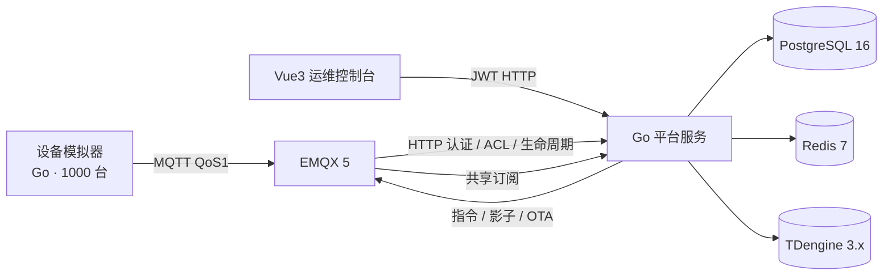

# IoT 设备接入与管理平台（智慧园区）

[](https://github.com/Donnow/iot-platform/actions/workflows/ci.yml)

基于 **EMQX + Go + TDengine** 的物联网设备接入与管理平台：覆盖设备接入认证、物模型遥测、规则告警、设备影子、指令下发、OTA 升级全链路，自带千台设备模拟器与 Vue3 运维控制台。单机 `docker compose up` 即可完整运行。

## 亮点

- **全链路可运行**：MQTT 接入 → 时序存储 → 实时控制台，一条龙，Compose 一键起，可现场演示
- **一机一密动态认证**：设备密钥由平台签发，EMQX HTTP 认证/授权与平台联动，设备级 topic ACL
- **设备影子**：desired/reported 分离；设备重连自动补发影子与未完成 OTA 任务
- **物模型驱动**：遥测按产品物模型校验后才落库，TDengine 超级表/子表 + 降采样聚合查询
- **文档完备**：SRS、架构、业务逻辑、API 契约、测试计划、排障记录（15 个真实问题）齐备
- **质量习惯**：分层结构、单元测试 + 进程内集成测试、Prometheus 指标、结构化日志

## 架构



## 核心功能

| 模块 | 说明 |
| --- | --- |
| 产品与物模型 | 产品、属性定义（类型/单位/范围），设备注册即签发密钥 |
| 设备接入 | MQTT 一机一密认证、心跳 + 遗嘱上下线检测、设备级 topic ACL |
| 遥测链路 | 物模型校验（产品缓存）→ TDengine 批量落库，多 worker 并行消费，支持区间查询、1m/5m/1h 降采样、最新值快照 |
| 规则与告警 | 条件规则命中产生告警，支持解除 |
| 设备影子 | desired/reported 分离；在线直发、离线缓存、重连补发（version 乐观锁列入演进需求） |
| 指令下发 | 命令 topic + 设备异步 ack，超时惰性标记 |
| OTA 升级 | 固件元数据登记、任务创建、设备阶段上报（downloading/installing/success） |
| 运维控制台 | Vue3 + ECharts：设备/产品/告警/固件管理、实时数据查看 |
| 可观测性 | `/metrics` Prometheus 指标（HTTP/MQTT/规则/告警计数器）、JSON 结构化日志 |

## 技术栈

| 组件 | 用途 | 为什么选它 |
| --- | --- | --- |
| EMQX 5.x | MQTT Broker | 一机一密动态认证、设备级 ACL、生命周期事件开箱即用；Erlang/OTP 架构，百万连接级 |
| Go 1.24（标准库 net/http） | 平台服务 | 分层单体：接入网关 + HTTP API + 仓储层，模块边界清晰、面试易讲透 |
| PostgreSQL 16 | 权威存储 | 产品/设备/影子/指令/OTA 元数据，jsonb 适配物模型与影子结构 |
| Redis 7 | 状态缓存 | 在线状态 TTL（下线自动过期）+ 影子缓存，Redis 不可用时 PostgreSQL 兜底 |
| TDengine 3.x | 时序存储 | 超级表/子表、降采样聚合、SQL 兼容、Docker 一键启动 |
| Vue 3 + ECharts | 运维控制台 | SPA + 实时曲线，nginx 反代 `/api` 无跨域问题 |
| Docker Compose | 部署 | 单机一键演示，面试可当场跑 |

## 快速开始

```bash
cp .env.example .env          # 修改 IOT_JWT_SECRET 为至少 16 字符的随机值
docker compose up --build -d
curl -fsS http://localhost:8080/healthz   # {"status":"ok"}
```

| 入口 | 地址 |
| --- | --- |
| 运维控制台 | http://localhost:3000 |
| 平台 API / Swagger UI | http://localhost:8080 / http://localhost:8080/docs |
| EMQX Dashboard | http://localhost:18083（admin / public） |
| MQTT / MQTT over WebSocket | 1883 / 8083 |

### 最小演示：设备上报遥测

```bash
# 1. 登录获取 JWT（首次启动已自动创建管理员，默认 admin / admin123456，
#    部署前务必通过 IOT_ADMIN_USERNAME / IOT_ADMIN_PASSWORD 修改）
TOKEN=$(curl -s -X POST http://localhost:8080/api/auth/login \
  -H 'Content-Type: application/json' \
  -d '{"username":"admin","password":"admin123456"}' \
  | python3 -c 'import json,sys; print(json.load(sys.stdin)["token"])')

# 2. 创建产品（记下返回的 product_key，或直接指定）
curl -s -X POST http://localhost:8080/api/products \
  -H "Authorization: Bearer $TOKEN" -H 'Content-Type: application/json' \
  -d '{"name":"温度传感器","device_type":"sensor","product_key":"temperature",
       "properties":[{"name":"温度","data_type":"float","unit":"℃"}]}'

# 3. 注册设备（响应中包含 device_secret，一机一密）
curl -s -X POST http://localhost:8080/api/devices \
  -H "Authorization: Bearer $TOKEN" -H 'Content-Type: application/json' \
  -d '{"product_key":"temperature","name":"会议室温度计","device_id":"temp-001"}'

# 4. 写入设备凭据并启动模拟器
cat > /tmp/devices.json <<'EOF'
[{"device_id":"temp-001","device_secret":"<上一步返回的 device_secret>"}]
EOF
go run ./cmd/devicesim -credentials /tmp/devices.json \
  -product-key temperature -type temperature -count 1 -interval 5s

# 5. 打开 http://localhost:3000 查看设备上线与实时曲线；
#    接口细节见 http://localhost:8080/docs
```

设备类型：`temperature` / `smoke` / `door` / `air-conditioner`，完整行为见 [docs/operations/device-simulator.md](docs/operations/device-simulator.md)。

### 面试演示剧本

1. 控制台设备页看到设备上线，实时曲线 5 秒一条
2. 影子同步：修改影子 desired → 在线设备直发，断开重连后自动补发
3. 指令下发：门禁设备收到 open/close，空调收到 setTemp 后温度逐步收敛
4. 告警：烟感 smoke_level 越过阈值产生 alarm 事件
5. OTA：登记固件 → 创建任务 → 模拟器上报 downloading → installing → success

## 测试

```bash
go test ./...                      # 后端单元测试 + 进程内集成测试
cd frontend && npm ci && npm test && npm run build  # 前端单元测试 + 生产构建（含 bundle budget 校验）
```

## 压力测试

2026-08-03 完成 1000 台设备实测（macOS / OrbStack 单机 Compose）：

| 指标 | 实测 |
| --- | --- |
| 在线设备 | 1001 台稳定 |
| 上报速率 | 200 msg/s（1000 台 × 5s），平台 0 错误 |
| TDengine 落库 | ~150 msg/s（75%，剩余被 ts 主键覆盖吸收，见下） |
| 端到端延迟 | P50 11ms / P95 18ms / P99 18ms / max 25ms |

压测暴露并修复了一个真实问题：模拟器所有设备 tick 相位同步，同一毫秒的
payload `ts` 在 TDengine 单表 ts 主键下相互覆盖（修复前落库率仅 ~17%）。
修复（ticker 随机相位偏移）后 10 台验证落库率 35% → 95%。完整记录与
复现命令见 [docs/operations/load-test.md](docs/operations/load-test.md)，
问题详情见 [docs/operations/issues-encountered.md](docs/operations/issues-encountered.md) #16/#17。

存储层已于 2026-08-04 由单普通表迁移为超级表/每设备子表模型（每设备独立 ts
主键，同毫秒多设备上报不再相互覆盖），迁移说明见
[docs/design/tdengine-stable-migration.md](docs/design/tdengine-stable-migration.md)，
迁移脚本为 [scripts/tdengine-migrate.sh](scripts/tdengine-migrate.sh)。

工具：
- [scripts/load-test.sh](scripts/load-test.sh)：一键注册设备 + 启动压测
- [cmd/latencyprobe](cmd/latencyprobe/)：端到端延迟探针（发布 → 平台消费 → TDengine → 查询可见）

## 目录结构

```text
cmd/platform/          # 平台服务入口（HTTP + MQTT 消费）
cmd/devicesim/         # 设备模拟器（4 种设备行为 + stress 模式）
cmd/latencyprobe/      # 端到端遥测延迟探针（压测工具）
internal/platform/     # 平台：httpapi / mqtt / storage / memory / domain / observability
internal/devicesim/    # 模拟器实现
frontend/              # Vue3 运维控制台
migrations/            # PostgreSQL schema
scripts/               # emqx-init / make-jwt / load-test / tdengine-migrate
docs/                  # 需求、设计、API 契约、测试、运维文档
```

## 文档

文档齐全，从 [docs/README.md](docs/README.md) 进入。**开发历程先看
[docs/TIMELINE.md](docs/TIMELINE.md)**（按时间线编号的阶段总览）。重点推荐：

- [需求规格说明书（SRS）](docs/requirements/iot-platform-srs.md) — 产品范围、MQTT topic 规范、验收基线
- [架构演进需求规格](docs/requirements/architecture-evolution-srs.md) — 可靠性、安全、可观测性与扩容需求
- [统一 TODO](docs/TODO.md) — 全部未完成任务、优先级、依赖与完成定义
- [业务逻辑详解](docs/design/business-logic.md) — 状态机、消息契约、容错机制（Baseline）
- [问题记录与排障](docs/operations/issues-encountered.md) — 17 个真实问题：现象/根因/解决（Baseline）
- [后端接口与消息契约](docs/api/backend-api.md) / [OpenAPI](docs/api/openapi.yaml)

## 已知限制

记录在 [docs/design/business-logic.md §7](docs/design/business-logic.md)：

- 设备密钥明文存储（未加盐哈希）；`/internal/*` 回调无 IP 白名单（依赖部署层限制）
- 角色仅有 admin 一种（JWT 携带 role claim，但尚未做接口级权限分级）
- 快照查询未走 Redis 缓存；规则/产品缺少更新、删除接口
- 告警条件恢复不自动解除（需手动解除）

## Roadmap

全部未完成工作统一维护在 [TODO.md](docs/TODO.md)，详细验收标准见
[架构演进需求规格说明书](docs/requirements/architecture-evolution-srs.md)。当前优先顺序为：

1. Redis 降级、安全边界与设备密钥治理
2. 遥测持久化接入和下行 Transactional Outbox
3. application/usecase 层、业务完整性与可观测性
4. 以 5000 msg/s 实测结果决定是否引入 Kafka 和多实例消费
