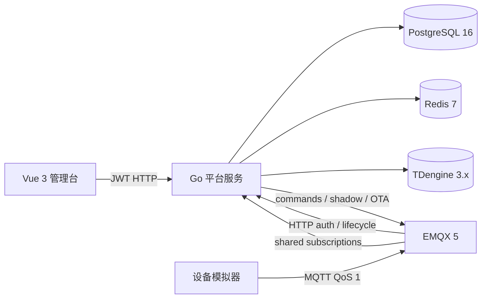

# 平台架构

| 项目 | 内容 |
| --- | --- |
| 版本 | v0.1 |
| 日期 | 2026-08-01 |
| 状态 | Draft |

## 运行拓扑

## 数据职责

PostgreSQL 是产品、设备、物模型属性、规则、告警、指令和 OTA 元数据的权威存储。TDengine 保存遥测的时间戳、设备标识、产品标识和动态 JSON 属性 payload。Redis 保存在线状态 TTL 和设备影子缓存；影子正文同时写入 PostgreSQL，Redis 不可用时由 PostgreSQL 兜底读取。

平台的 MQTT 消费者订阅遥测、设备事件、指令回复和 reported shadow。遥测先按产品物模型校验，再写入 TDengine 并进入规则判断。EMQX 只负责连接、认证、生命周期通知和消息转发；设备 ACL 由认证回调按设备 topic 返回。

## 启动模式

生产和 Compose 默认使用 `IOT_STORAGE_MODE=persistent`。本地快速开发可设置
`IOT_STORAGE_MODE=memory`，此模式不要求 PostgreSQL、Redis 和 TDengine，但重启后数据会丢失。持久化模式启动时会对三个依赖执行连接检查，并初始化 TDengine schema；失败会指数退避重试。

## 相关契约

HTTP 路由和 schema 见 [OpenAPI](../api/openapi.yaml)，消息 topic 和 payload 见
[后端接口与消息契约](../api/backend-api.md)，部署参数见
[平台运行手册](../operations/platform.md)。
